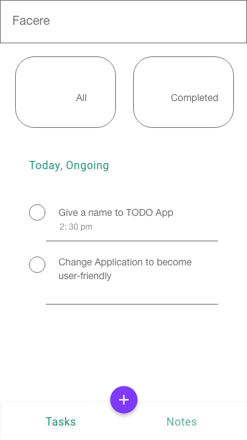
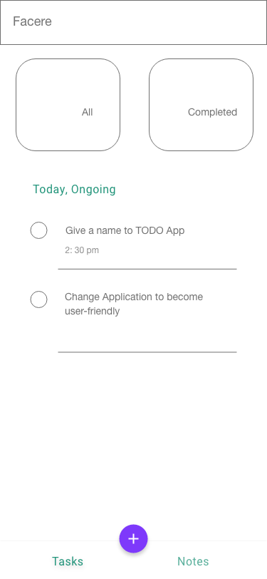
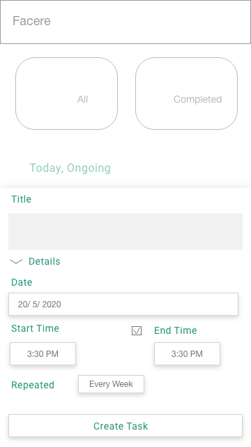
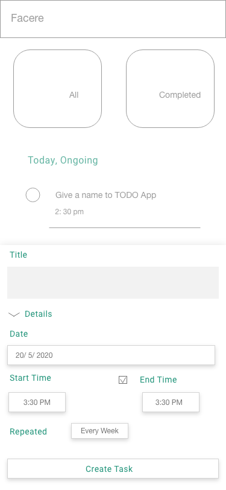

# todo

Todo Flutter APP

## First things Goes

This project is a to-do app for students and observers to record their tasks: daily, milestones and goals to be reviewed easily.

## Deployment

Application Name - Facere

Version - 1

## Application Design

Versatile Application Figure for both Mobile(Ios and Android).

Temporarily apply on 'Material Design'

### Tasks Page

|                        (Android)                        |                        (Iphone)                        |
| :-----------------------------------------------------: | :----------------------------------------------------: |
|  |  |

### Home Screen - Add New Task

|                          (Android)                           |                          (Iphone)                          |
| :----------------------------------------------------------: | :--------------------------------------------------------: |
|  |  |

## Data & Backend Integration

* Sqlite

## Further Features To Add on

* Login Authenicating
* Syncing on network (Accessible at anywhere)
* Assigning tasks to someone

This repository can be used for Learning Purpose by Anyone.
