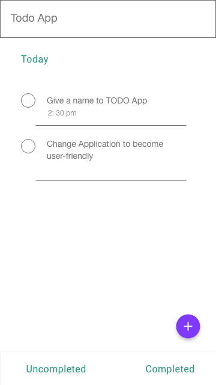
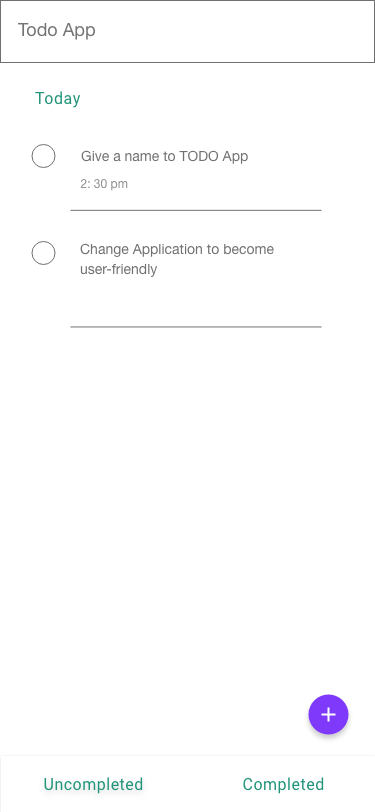

# todo

Todo Flutter APP

## First things Goes

This project is a to-do app for students and observers to record their tasks: daily, milestones and goals to be reviewed easily.

## Mock Application Design

Versatile Single Screen Application Figure for both Mobile(Ios and Android).

Temporarily apply on 'Material Design'

|Home Screen (Android)| Home Screen (Iphone)|
|:-:|:-:|
|||

## Data & Backend Integration

* Sqlite

## Further Features To Add on

* Login Authenicating
* Syncing on network (Accessible at anywhere)
* Assigning tasks to someone

This repository can be used for Learning Purpose by Anyone.
